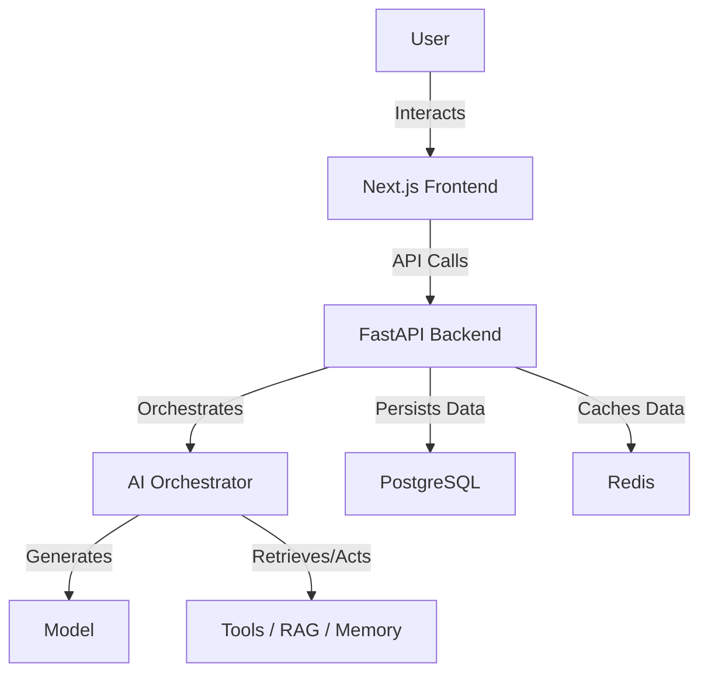

# Architecture

## High-level architecture

## Future AI architecture

**IMPLEMENTED IN PHASE 2**

* AI orchestrator (Basic service layer)
* Model integration (OpenAI streaming)
* Authentication (Supabase Auth & JWKS validation)
* PostgreSQL Persistence (SQLAlchemy & Alembic)
* User & Conversation identity isolation (IDOR protection)

**FUTURE COMPONENTS - NOT IMPLEMENTED YET**

* Model router (Multi-provider)
* Memory
* RAG
* Tool system
* Agent system
* Security/guardrails
* Audit logging

## Future cybersecurity architecture

**FUTURE COMPONENTS - NOT IMPLEMENTED IN PHASE 0**

* Security Agent
* SOC Agent
* Threat Intelligence Agent
* GRC Agent
* DevSecOps Agent
* Cloud Security Agent
